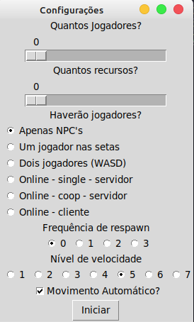

# GAME IN TKINTER

[](https://www.python.org/)

> Um simples jogo com o objetivo original de aprender Orientação a objetos em python

>> "O objetivo deste trabalho inicialmente foi aprender OO e criar uma IA, tarefa cumprida em parte, tarefa que foi cumprida quase por completo, com a ausência da IA, apesar disso foi terminado acrescentando um algorítmo simples porém eficaz para os bots além da adição de um multiplayer online".

### Tela de gameplay

<p float="left">
  <image width=100%, src="./static/game.png"/> 
</p>

## Obtenção do Código

### Download
Download direto pelo botão verde **Clone or Download** ou abra o VSCode, pressione Ctrl+Shift+P e digite *"Git clone"* e cole *https://github.com/JDaniloC/GAME-Ferias-2019.1.git* para salvar em um repositório local.

### Como instalar

```shell
// Se estiver no windows pode inicia-lo através do arquivo Jogo.exe
// Se estiver no linux ou quiser iniciar através do python, execute o arquivo Jogo.py
```



## O que aprendi
 - Criar um jogo sem framework de jogos
 - Inteligencia para inimigos
 - Multiplayer local e online

## Novidades

- [x] *Jogo funcional sem bugs, criado a partir do Tkinter*

- [x] *Modo apenas visualização com os bots*

- [x] *Modo para uma ou duas pessoas local*

- [x] *Modo para uma ou duas pessoas online (+1 da pessoa online)*

- [x] *Bots que vencem pessoas*

- [x] *Escolha de respawn e velocidade do jogo*

### Detalhe
O código foi feito com pouco conhecimento sobre patherns e organização, então tolere a desorganização do mesmo.

## Contribuidores
José Danilo, Centro de Informática, UFPE.
